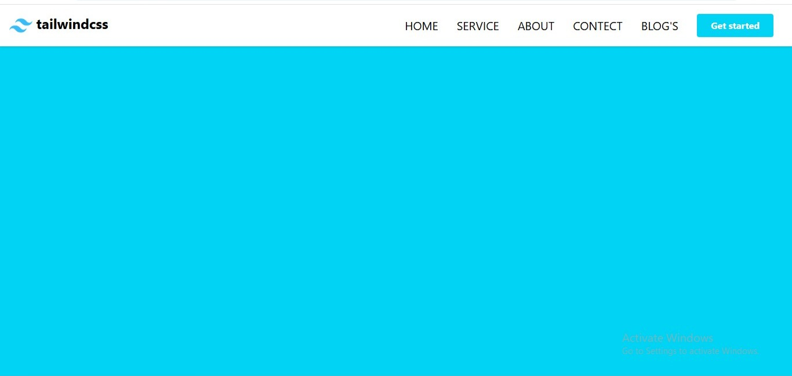

# 🌐 Responsive Navbar using Tailwind CSS

This project is a **fully responsive navigation bar (Navbar)** built using **Tailwind CSS (CDN)**.  
It features a clean, modern design and works seamlessly across **desktop, tablet, and mobile devices**.  
Perfect for beginners learning Tailwind CSS and responsive layouts ✨

---

## 📸 Screenshot




---

## 🚀 Features
- 🧭 **Fully responsive design** — works on all screen sizes  
- 🌈 Built using **Tailwind CSS CDN** (no extra setup needed)  
- 📱 **Mobile hamburger menu** for smaller devices  
- 💻 **Horizontal menu** for large screens  
- 🧼 Clean & beginner-friendly code structure  
- 🛠️ Easy to customize (colors, links, logo, etc.)

---

## 🛠️ Technologies Used
- **HTML5**  
- **Tailwind CSS (via CDN)**

---

## 📂 Project Structure
```bash
├── index.html             # Main HTML file with Tailwind CDN
├── tailwind-logo.png      # Optional logo image
└── tailwind-navbar.jpeg   # Project screenshot
```

## 🔧 How to Use
1. Clone this repository:
   ```bash
   git clone https://github.com/Farah-Saleem270/NavbarwithTailwindCss
   ```
2. Open the project folder:
   ```bash
   cd NavbarwithTailwindCss
   ```
3. Run index.html in your browser.
4. Resize the window to see the responsive behavior 🌐


## 📌 Tailwind CDN
This project uses Tailwind via CDN.
```html
<script src="https://cdn.tailwindcss.com"></script>
```


## 👩‍💻 Author
Created with ❤️ by **Farah Saleem**  
GitHub: [Farah-Saleem270](https://github.com/Farah-Saleem270)


⭐ If you like this project, don’t forget to give it a star on GitHub!